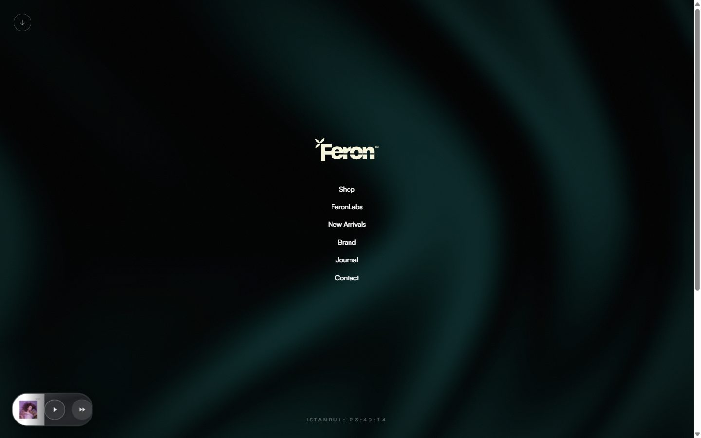

<div align="center">

# Feron — Premium Lifestyle Storefront

**A motion-first fashion e-commerce experience: CMS-driven catalog, real backend, zero template feel.**

<a href="https://feron-e-ticaret-feron-labs-web.vercel.app"></a>
&nbsp;


<br/><br/>

<a href="https://feron-e-ticaret-feron-labs-web.vercel.app"></a>

</div>

## ✨ Highlights

- **Editorial landing**: animated hero splash, text reveals, parallax imagery and stacked sections on top of Lenis smooth scrolling.
- **Headless catalog**: products, collections and journal posts are edited in an **embedded Sanity Studio** (`/studio`) and rendered with `next-sanity`.
- **Real backend**: Supabase (schema, seed and setup SQL included) for data and auth-ready sessions via `@supabase/ssr`.
- **Shop flow**: filterable product grid (Tops, Bottoms, New, seasonal drops), product detail pages and a Zustand cart with toast feedback.
- **Brand details**: custom cursor, live Istanbul clock, ambient music mini-player, newsletter capture and a contact form backed by a Nodemailer API route.
- **FeronLabs**: a separate onboarding surface for the brand's experimental line.

## 🧱 Tech Stack

| Layer | Choice |
|---|---|
| Framework | Next.js 16 (App Router) · React 19 · TypeScript |
| Styling & motion | Tailwind CSS v4 · Framer Motion · Lenis · Embla Carousel |
| Content | Sanity 5 (embedded Studio) · `next-sanity` |
| Data | Supabase (Postgres) · Zustand (cart state) |
| Messaging | Nodemailer (contact API) · Sonner (toasts) |
| Hosting | Vercel |

## 🗺️ Routes

| Route | What it does |
|---|---|
| `/` | Splash landing + navigation |
| `/shop`, `/shop/[id]` | Catalog grid and product detail |
| `/brand`, `/journal`, `/our-store` | Editorial brand pages |
| `/feronlabs` | FeronLabs onboarding |
| `/contact` → `/api/contact` | Contact form, delivered by email |
| `/studio` | Embedded Sanity Studio |

## 🚀 Getting Started

```bash
npm install
# create .env.local with the variables below
npm run dev                  # http://localhost:3000
```

| Variable | Purpose |
|---|---|
| `NEXT_PUBLIC_SANITY_PROJECT_ID`, `NEXT_PUBLIC_SANITY_DATASET`, `NEXT_PUBLIC_SANITY_API_VERSION` | Sanity content source |
| `NEXT_PUBLIC_SUPABASE_URL`, `NEXT_PUBLIC_SUPABASE_ANON_KEY` | Supabase project |
| `EMAIL_USER`, `EMAIL_PASS` | SMTP account for the contact form |

Database: run `supabase/schema.sql`, then `supabase/seed.sql` in the Supabase SQL editor.

---

<div align="center"><sub>Designed & built by <a href="https://github.com/Tguleryuz52">Talha Güleryüz</a></sub></div>
